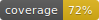

# Django EVM Indexer



Fast and scalable solution for off-chain indexers of events.  
Unsophisticated to configure, easy to maintain.  

Python version: **3.10**  
Django version: **4.2.1**
# Installation and run
### Set up a local instance of the project
Clone this repository and start simple Python environment

```
python3.10 -m venv venv
source venv/bin/activate
pip install -r requirements.txt
```

Required envs to launch Django server are described in `env.example`. For better development experience
there are Pycharm run configurations in pycharm-run folder. These configurations are already tunes to search
for envs in `.env` file. For your development envs it is recommended to use `.env` filename.
Copy template from `env.example` and then provide your own env values.

### Set up postgres instance
Django EVM indexer uses Postgresql as database. You can either use Docker container with database or a local instance.
Here I provide an example how to start a local instance of postgres using brew
```shell
# actually postgresql version doesn't matter, just provide some non-outdated one
brew install postgresql@14

brew services restart postgresql@14
psql template1
create database "django_evm_indexer";
create user django_evm_indexer with encrypted password 'your_password';
grant all privileges on database "django_evm_indexer" to django_evm_indexer;

# this one is only for tests execution
alter user django_evm_indexer createdb;
```

### Create superuser
You can create a superuser to access your admin panel using either `Create Superuser` run configuration or
```shell
python create_super_user.py
```
Note: make sure you have applied your envs in current terminal  

### Start Django server

You can start Django development server either with `Django Server` run configuration in PyCharm or
```shell
python manage.py runserver
```
Note: make sure you have applied your envs in current terminal  

### Start indexer in debug mode
There is a simple way to launch an indexer since all indexers are launched as docker containers within Django panel
which is quite difficult to debug.  
Firstly you need to create an `Indexer` in database, provide a `Network`, watched `Tokens` etc.
Then you can run a debug instance of indexer using either `Debug Indexer` or 
```shell
python indexer/run.py
```
Note: make sure you have applied your envs in current terminal. There are envs which are related only to indexer, make sure
you have provided them. You can even store all envs in one `.env` since Indexer instance needs `Django Server` envs + its own envs

### Database migrations
For migrations, you can use either `Makemigrations` and `Migrate` run configurations in PyCharm or
```shell
python manage.py makemigrations
python manage.py migrate
```
Note: make sure you have applied your envs in current terminal  

# Indexers
Every indexer is launched in Django Admin panel as a separate container using Docker SDK. It allows administrator
to configure and control indexers inside the Admin panel.

